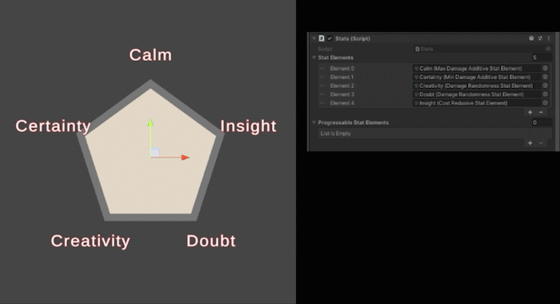
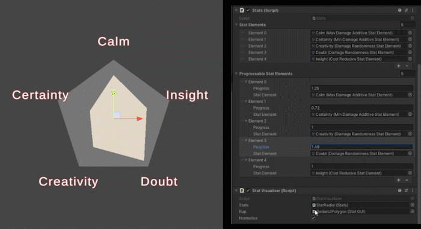
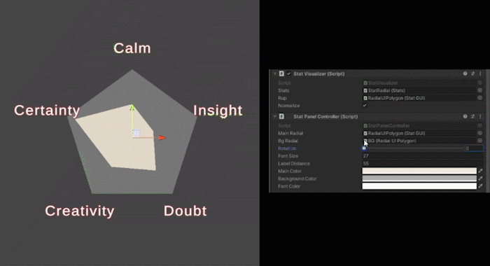
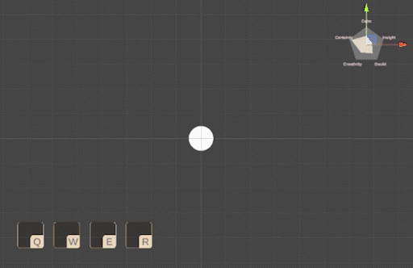
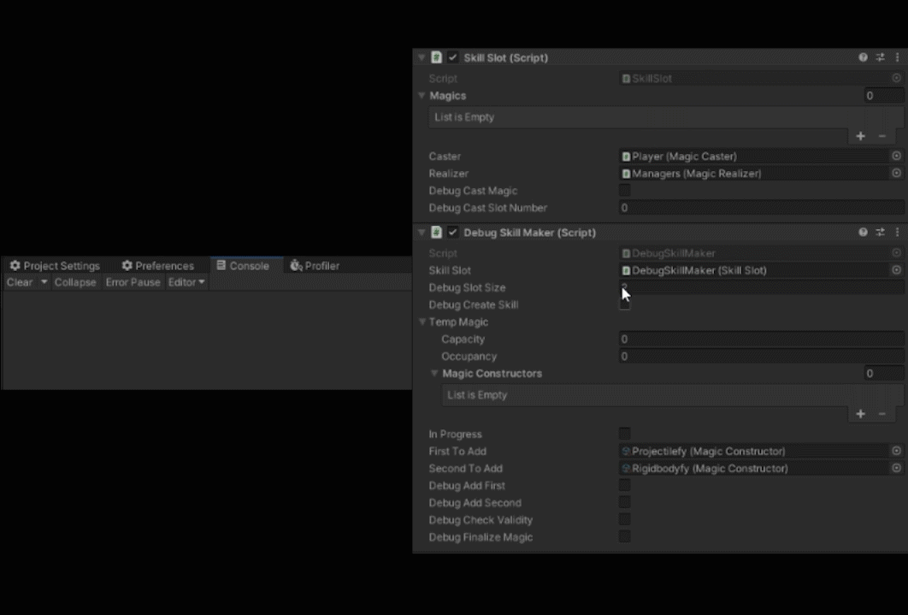
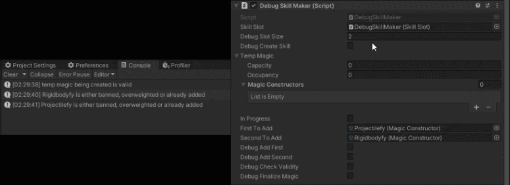
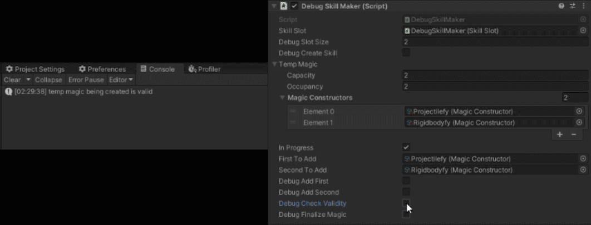

# Combination Magic System

This project aims to implement a bottom-up magic skill system, where magics are not delivered as a final product, but instead a constructors of it is given to players, and players can freely create their wanted magics.

For detailed information, read [./Assets/ReadMe.md](Assets/ReadMe.md)

# Demo

## Radial Stat Pannel

### Normalized

### Unnormalized

### Controlling Other Elements

## Quick Access Keys

## Skill Maker (WIP)

### Sufficient Capacity

### Insufficient Capacity

### Trying to Add Duplicate Constructor
